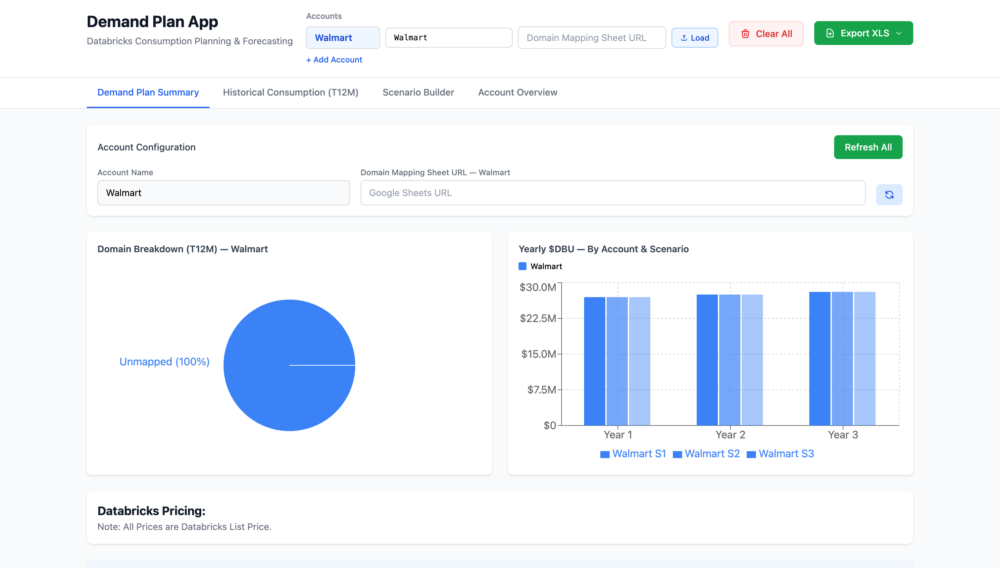
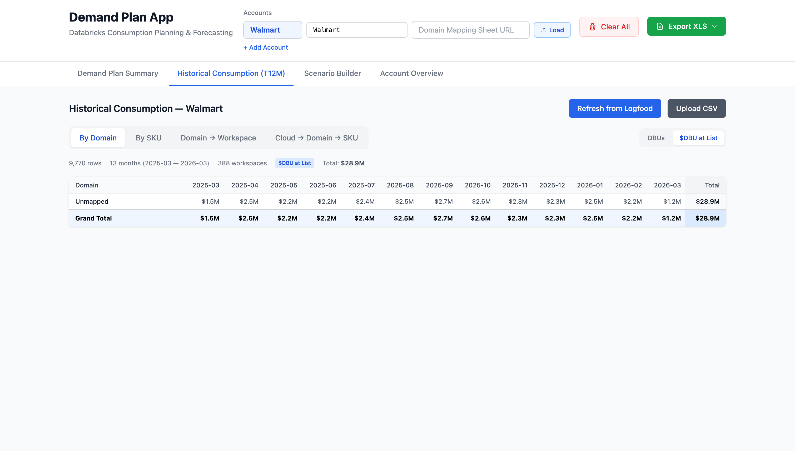
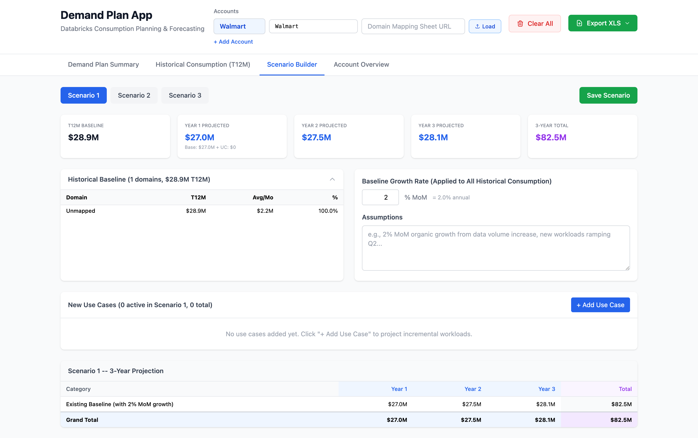
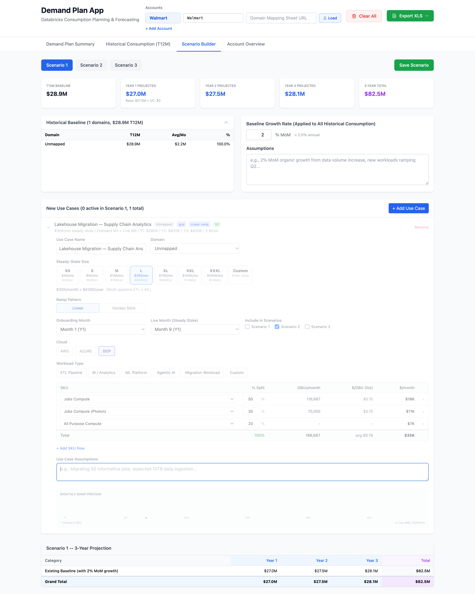
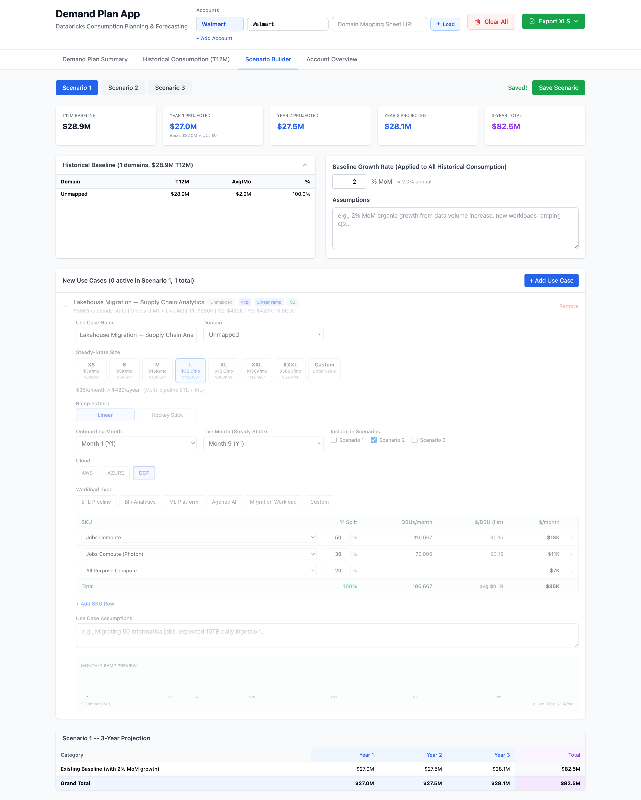
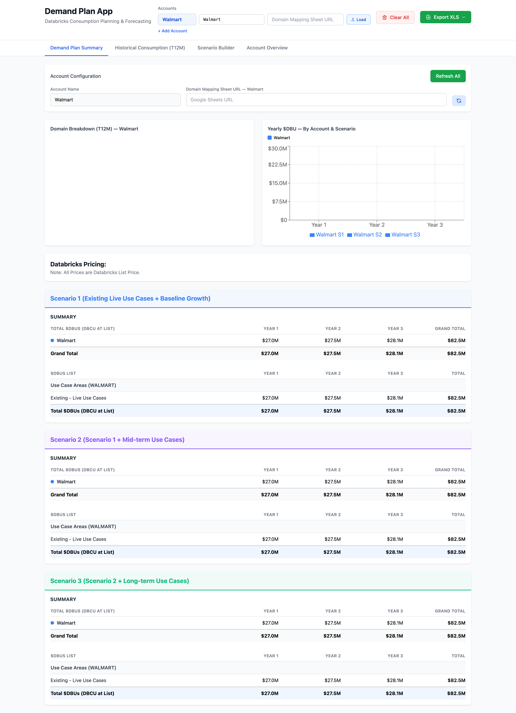
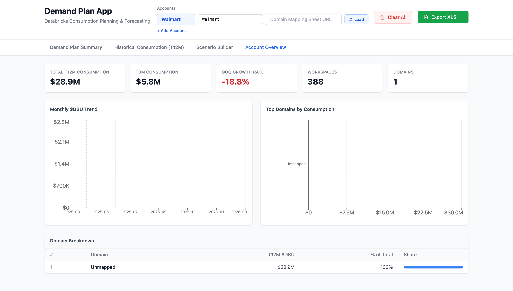

# Demand Plan App

A Databricks consumption planning and forecasting tool for Field Engineering. Load historical Logfood data per account, build 3-scenario demand plans, and export to Excel.

---

## Prerequisites

| Tool | Version | Notes |
|------|---------|-------|
| Python | 3.10+ | Backend (FastAPI) |
| Node.js | 18+ | Frontend (React + Vite) |
| Databricks CLI | Latest | Authenticated to Logfood workspace |
| `databricks-sdk` | 0.33.0 | Installed via pip |
| Google Cloud SDK (`gcloud`) | Latest | Required for Google Drive/Sheets access |

---

## Local Deployment

### 1. Clone the Repository

```bash
git clone https://github.com/sumitprakash-forge/demand-plan-app.git
cd demand-plan-app
```

### 2. Install Backend Dependencies

```bash
cd server
pip install -r requirements.txt
cd ..
```

### 3. Install Frontend Dependencies

```bash
cd frontend
npm install
cd ..
```

### 4. Install & Authenticate Google Cloud SDK

The app uses `gcloud` to access Google Sheets for domain mapping.

**Install gcloud (macOS):**
```bash
brew install --cask google-cloud-sdk
```

**Install gcloud (macOS — without Homebrew):**
```bash
curl -O https://dl.google.com/dl/cloudsdk/channels/rapid/downloads/google-cloud-cli-darwin-arm.tar.gz
tar -xf google-cloud-cli-darwin-arm.tar.gz
./google-cloud-sdk/install.sh
```

**Install gcloud (Linux):**
```bash
curl -O https://dl.google.com/dl/cloudsdk/channels/rapid/downloads/google-cloud-cli-linux-x86_64.tar.gz
tar -xf google-cloud-cli-linux-x86_64.tar.gz
./google-cloud-sdk/install.sh
```

**Authenticate with your Databricks Google account:**
```bash
gcloud auth login --enable-gdrive-access
```

Verify it works:
```bash
gcloud auth print-access-token
```

### 5. Authenticate with Databricks (Logfood)

The app queries Logfood for consumption data. Ensure the `logfood` profile is configured:

```bash
databricks auth profiles | grep logfood
```

If not set up:

```bash
databricks auth login https://adb-2548836972759138.18.azuredatabricks.net/ --profile=logfood
```

---

## Starting the App

Run both backend and frontend with one command:

```bash
bash run.sh
```

This starts:
- **Backend** (FastAPI) → `http://localhost:8000`
- **Frontend** (React/Vite) → `http://localhost:5173`

Open **http://localhost:5173** in your browser.

To stop:
```bash
pkill -f uvicorn; pkill -f vite
```

---

## Domain Mapping Sheet Format

The app accepts a Google Sheets URL for mapping Databricks workspaces to business domains. The sheet must have these columns:

| account_name | cloudtype | org | sfdc_workspace_name | Domain |
|---|---|---|---|---|
| Walmart | gcp | Sams Club | prod-sams-cdp-platform | CDP Platform |
| Walmart | azure | Sams Club | prod-supplychain-data | Supply Chain |
| Walmart | gcp | Walmart | dev-ASA-ws-usc1 | Assortment & Space |

**Example sheet (Walmart):** `https://docs.google.com/spreadsheets/d/1w4EhFgEvdNMhwEYpHYNpP0wHoG9MKILaP3YDBqHHQfM/edit`

> The sheet must be publicly readable or shared with the authenticated Google account.

---

## Functionality

### Header — Account Configuration



The header lets you configure one or more accounts:

| Field | Description |
|-------|-------------|
| **Display Name** | Label shown in charts and tables (e.g. `Walmart`) |
| **SFDC Account ID / Name** | 18-char Salesforce ID or exact Logfood account name |
| **Domain Mapping Sheet URL** | Google Sheets URL mapping workspaces → domains |
| **Load** button | Fetches fresh data from Logfood for that account |
| **+ Add Account** | Add a second/third account for side-by-side comparison |
| **Clear All** | Wipes all cached data + resets to a blank account |
| **Export XLS** | Downloads a full Excel workbook for the chosen scenario |

---

### Tab 1 — Demand Plan Summary


The main planning view showing:

- **Domain Breakdown (T12M)** — Donut chart of T12M spend by business domain
- **Yearly $DBU by Account & Scenario** — Bar chart comparing Year 1/2/3 across all accounts and scenarios (color-coded per account)
- **Scenario 1, 2, 3 detail tables** — Annual breakdown by use case area with 3-year totals at Databricks list price
  - Scenario 1: Existing live use cases + baseline growth
  - Scenario 2: S1 + mid-term use cases
  - Scenario 3: S2 + long-term use cases

When multiple accounts are loaded, each account gets its own color and grouped bars.

---

### Tab 2 — Historical Consumption (T12M)



Shows trailing 12-month actual Databricks consumption pulled from Logfood:

- Monthly $DBU trend chart per account
- Domain-level breakdown (if domain mapping sheet is provided)
- Cloud type split (AWS / Azure / GCP)
- SKU-level pricing detail
- Raw workspace-level data table

Use **Refresh** to re-pull fresh data from Logfood.

---

### Tab 3 — Scenario Builder



Build and edit use cases across 3 scenarios:

- Add use cases with name, steady-state DBU, onboarding month, live month, and ramp type (linear / accelerated)
- Assign each use case to Scenario 1, 2, and/or 3
- Adjust baseline growth percentage
- Changes auto-save and immediately update the Summary tab
- Use case projections ramp from onboarding month to live month then hold at steady state across 36 months

#### Adding a Use Case — Step by Step

**Step 1:** Click **+ Add Use Case** to create a new use case row, then click on it to expand the edit form.

**Step 2:** Fill in the use case details:



| Field | Description | Example |
|-------|-------------|---------|
| **Use Case Name** | Descriptive label | `Lakehouse Migration — Supply Chain Analytics` |
| **Domain** | Business domain from mapping sheet | `Supply Chain` |
| **Steady-State Size** | Monthly $DBU at full ramp (XS→XXXL or Custom) | `L — $35K/mo` |
| **Ramp Pattern** | Linear or Hockey Stick | `Linear` |
| **Onboarding Month** | Month the workload begins onboarding | `Month 1 (Y1)` |
| **Live Month** | Month it reaches full steady state | `Month 9 (Y1)` |
| **Include in Scenarios** | Which scenarios include this UC | `S1`, `S2`, `S3` |
| **Cloud** | AWS / Azure / GCP | `GCP` |
| **Workload Type** | ETL Pipeline, BI/Analytics, ML Platform, Agentic AI, Migration, Custom | `ETL Pipeline` |
| **Assumptions** | Free-text notes for the use case | `Migrating 200 Informatica jobs...` |

**Step 3:** Click **Save Scenario** — the projection table updates immediately.



**Step 4:** Switch to **Demand Plan Summary** to see the use case reflected in all three scenarios.



---

### Tab 4 — Account Overview



High-level account metrics:

- Total T12M spend
- Active workspace count
- Cloud mix
- Top domains by spend
- MoM growth trend

---

## Data Flow

```
Google Sheets (Domain Mapping)
         ↓
    [Load button]
         ↓
Logfood (Databricks consumption SQL)
         ↓
   FastAPI backend (server/)
   Caches to server/data/*.json
         ↓
   React frontend (frontend/)
   localStorage (account config)
```

---

## Cache & Reset

- **Server cache**: `server/data/*.json` — per-account consumption, scenario, and domain mapping files
- **Browser cache**: `localStorage['demandplan_accounts']` — account names, SFDC IDs, sheet URLs
- **Clear All button** wipes both simultaneously and reloads to a blank state

---

## Export

Click **Export XLS → Scenario N** to download a full Excel workbook containing:

- Summary sheet (all accounts, all scenarios)
- Historical data by domain, SKU, and cloud
- 36-month projections per use case
- Scenario assumptions and baselines

---

## Project Structure

```
demand-plan-app/
├── run.sh                  # Start both backend and frontend
├── frontend/
│   ├── src/
│   │   ├── App.tsx          # Main app, account config, header
│   │   ├── api.ts           # API client functions
│   │   ├── export.ts        # Excel export logic
│   │   └── components/
│   │       ├── SummaryTab.tsx
│   │       ├── HistoricalTab.tsx
│   │       ├── ScenarioTab.tsx
│   │       └── OverviewTab.tsx
│   └── package.json
├── server/
│   ├── main.py              # FastAPI routes + cache logic
│   ├── logfood.py           # Logfood SQL queries via Databricks SDK
│   ├── sheets.py            # Google Sheets domain mapping reader
│   ├── models.py            # Pydantic models
│   └── requirements.txt
└── docs/
    └── screenshots/         # UI screenshots for this README
```
