# Demand Plan App -- User Guide

**Databricks Consumption Planning & Forecasting Tool**

This guide walks through every feature of the Demand Plan App, a tool designed for Databricks Field Engineers to build consumption forecasts and demand plans for customer accounts. It pulls historical data from Logfood, lets you model new use cases across three scenarios, and exports polished Excel deliverables.

---

## Table of Contents

1. [Overview](#overview)
2. [Local Deployment Guide](#local-deployment-guide)
3. [Login](#login)
4. [Setup Tab](#setup-tab)
5. [Historical Consumption (T12M) Tab](#historical-consumption-t12m-tab)
6. [Demand Plan Summary Tab](#demand-plan-summary-tab)
7. [Scenario Builder Tab](#scenario-builder-tab)
8. [Consumption Forecast Tab](#consumption-forecast-tab)
9. [Account Overview Tab](#account-overview-tab)
10. [Export XLS](#export-xls)
11. [Use Case Walkthrough: Kroger](#use-case-walkthrough-kroger)

---

## Overview

The Demand Plan App is a full-stack application (React + FastAPI) that enables Databricks Field Engineers to:

- **Pull historical consumption data** from Logfood (trailing 12 months) for any SFDC account
- **Map workspaces to business domains** via CSV upload, enabling domain-level analysis
- **Model incremental use cases** with SKU-level breakdown, t-shirt sizing, ramp patterns, and custom pricing
- **Build three scenarios** (S1/S2/S3) representing conservative, moderate, and aggressive growth
- **Forecast consumption** month-over-month for up to 36 months with baseline growth and use case overlays
- **Compare scenarios** side-by-side in a summary view with charts
- **Export everything** to a branded multi-sheet Excel workbook for customer delivery

### Architecture

| Component | Technology | Port |
|-----------|-----------|------|
| Frontend | React + Vite + TypeScript + Tailwind CSS | 5174 |
| Backend | Python FastAPI + uvicorn | 8000 |
| Data Source | Logfood (Databricks internal) via SQL warehouse | -- |
| Auth | PAT-based authentication with JWT session cookies | -- |
| Export | ExcelJS (client-side, multi-sheet branded workbook) | -- |

---

## Local Deployment Guide

### Prerequisites

- Python 3.11+
- Node.js 18+
- A Databricks Personal Access Token (PAT) for the Logfood workspace
- Access to: `https://adb-2548836972759138.18.azuredatabricks.net`

### Setup Steps

```bash
# 1. Clone the repository
git clone <repo-url>
cd demand-plan-app

# 2. Install Python dependencies
pip install -r requirements.txt

# 3. Install frontend dependencies
cd frontend
npm install
cd ..

# 4. Start both servers
./run.sh
# Or manually:
#   Terminal 1: cd server && uvicorn main:app --host 0.0.0.0 --port 8000 --reload
#   Terminal 2: cd frontend && npm run dev
```

### Accessing the App

Open your browser to **http://localhost:5174**

---

## Login

When you first open the app, you are presented with the login page.

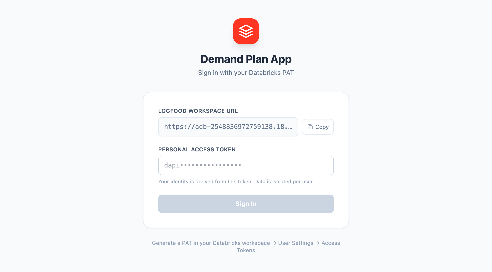

**Steps:**

1. The **Logfood Workspace URL** is pre-filled: `https://adb-2548836972759138.18.azuredatabricks.net`
2. Enter your **Databricks Personal Access Token (PAT)** in the token field
3. Click **Sign In**

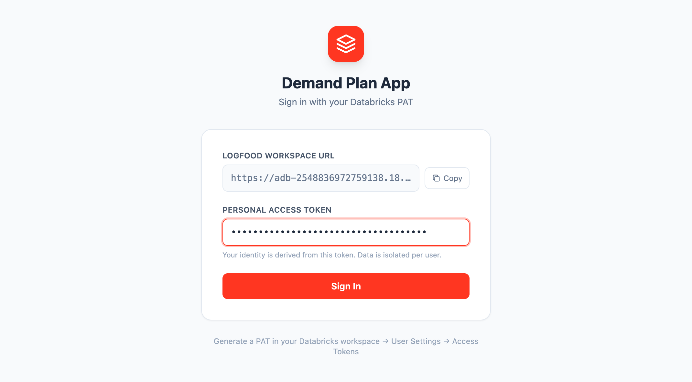

Once authenticated, the app creates a JWT session cookie. Your email and workspace are displayed in the header bar. The session persists until you sign out or close the browser.

---

## Setup Tab

The Setup tab is your starting point. It has two sections: **Logfood Workspace** configuration and **Pick Accounts**.

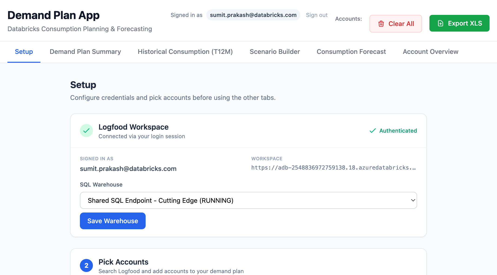

### Step 1: Logfood Workspace

After login, this section shows:

- **Signed in as**: your Databricks email
- **Workspace**: the connected Logfood URL
- **SQL Warehouse**: a dropdown to select which warehouse to use for queries. Pick a running warehouse (e.g., "Shared SQL Endpoint - Cutting Edge (RUNNING)")
- Click **Save Warehouse** to persist your selection

### Step 2: Pick Accounts

1. Type an **account name or SFDC ID** in the search box
2. Click **Search** -- results come from Logfood

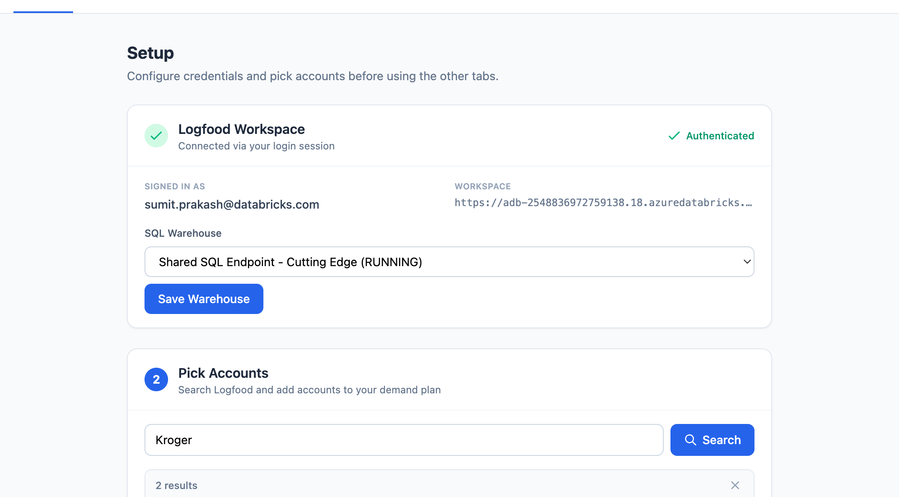

3. Click the **+** button next to the desired account to add it

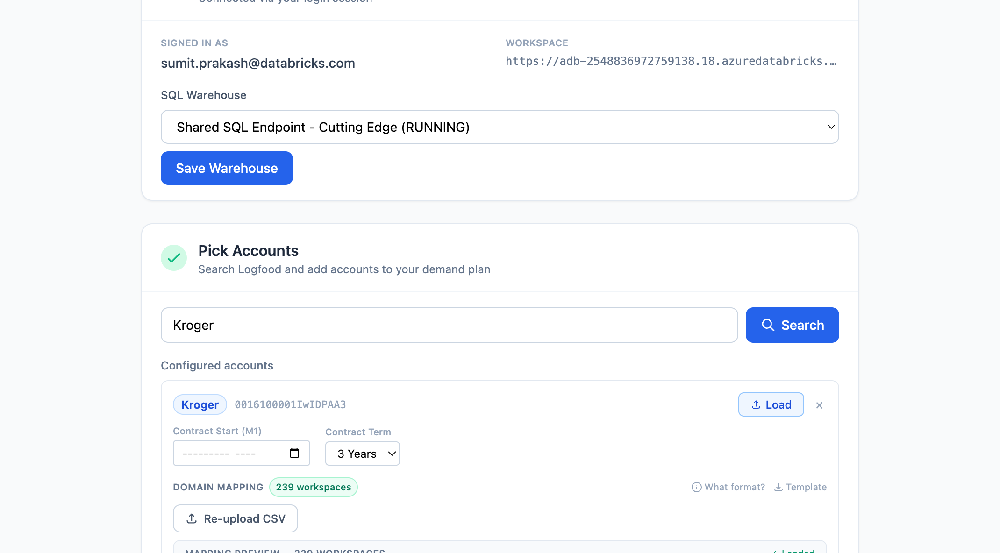

### Per-Account Configuration

Once an account is added, configure:

- **Contract Start (M1)**: The month/year when the contract begins (e.g., April 2026). This anchors all scenario month labels (M1Y1, M2Y1, etc.)
- **Contract Term**: 1 Year, 3 Years, or 5 Years -- determines the projection horizon
- **Load button**: Click to pull T12M consumption data from Logfood
- **Domain Mapping CSV**: Upload a CSV mapping workspace names to business domains

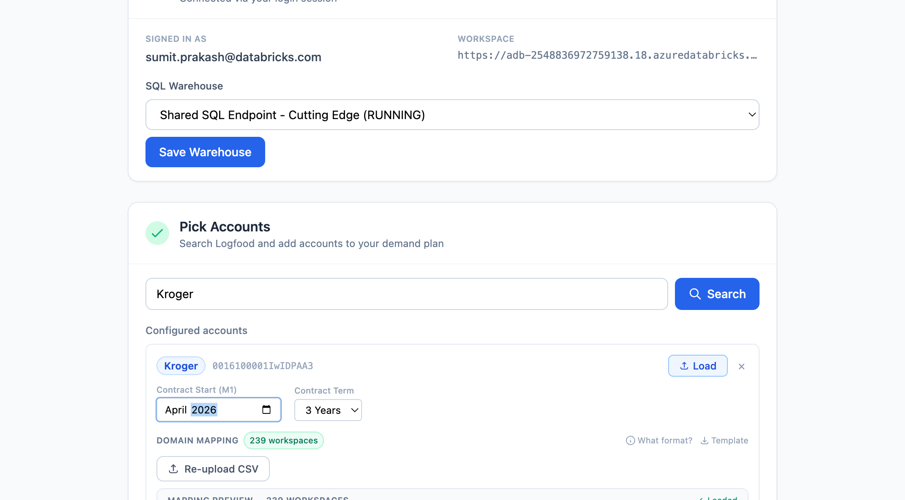

### Domain Mapping

Domain mapping is critical for meaningful analysis. Without it, all consumption lands in "Unmapped."

**CSV Format** (two columns, no header required):
```
workspace_name,domain
my-etl-workspace,Supply Chain
my-bi-workspace,Merchandising
```

- Click **Template** to download a pre-filled CSV with all workspace names from the account
- Click **Re-upload CSV** to replace the current mapping
- Click **What format?** for format guidance
- The preview table shows the first few rows of the loaded mapping

---

## Historical Consumption (T12M) Tab

This tab displays the trailing 12 months of actual consumption data pulled from Logfood.

### By Domain View (Default)

Shows consumption aggregated by business domain, with monthly columns and totals.

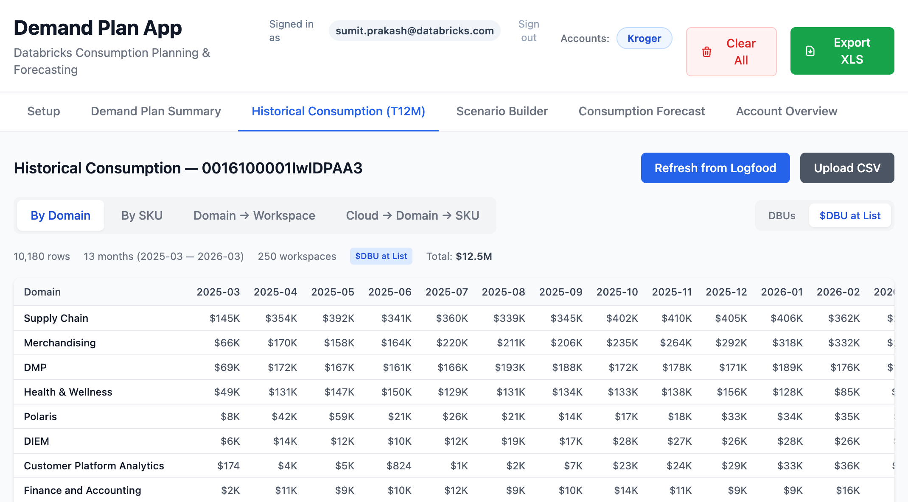

Key information displayed:
- **Row count**: Total raw data rows (e.g., 10,180 rows)
- **Month range**: 13 months shown (e.g., 2025-03 through 2026-03)
- **Workspace count**: Number of workspaces in the data (e.g., 250)
- **Grand Total**: Total $DBU at list price (e.g., $12.5M)

### By SKU View

Aggregates the same data by Databricks SKU (Jobs Compute, SQL Warehouse, etc.).

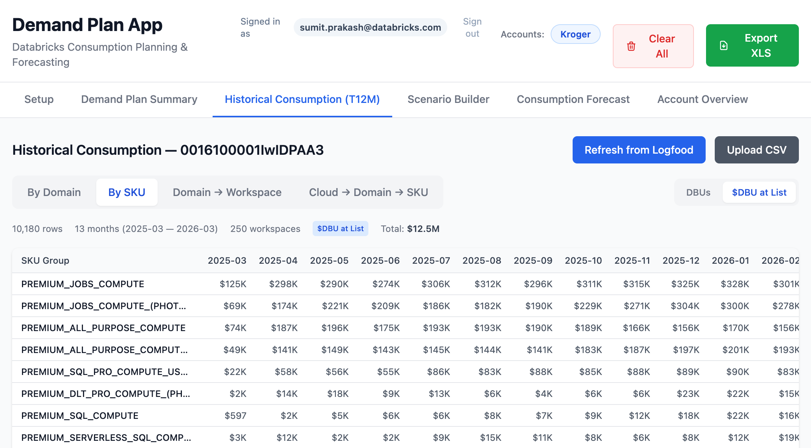

### Domain to Workspace View

Expandable hierarchy -- click a domain to see individual workspace contributions.

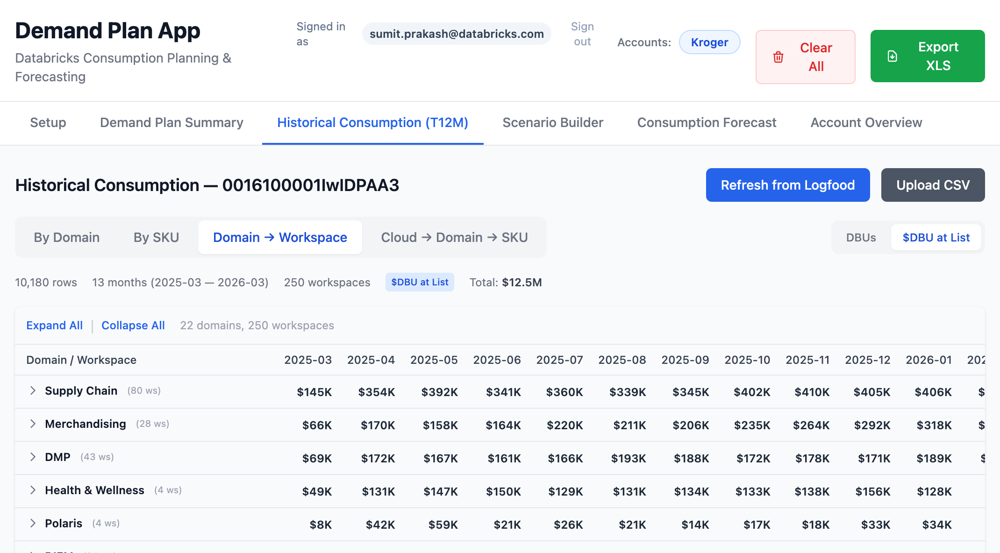

### Cloud to Domain to SKU View

Three-level hierarchy: Cloud provider > Domain > SKU, with expand/collapse controls.

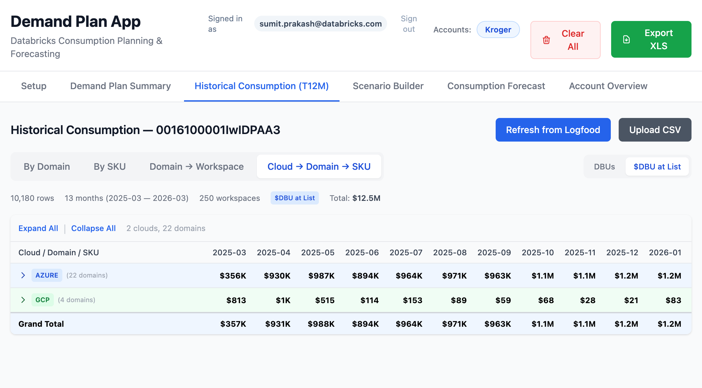

### Metric Toggle

- **DBUs**: Raw DBU volume consumed
- **$DBU at List**: Dollar value at list price (default)

### Actions

- **Refresh from Logfood**: Re-query the warehouse for latest data
- **Upload CSV**: Manually upload consumption data as a fallback

---

## Demand Plan Summary Tab

The Summary tab provides a high-level comparison of all three scenarios side-by-side.

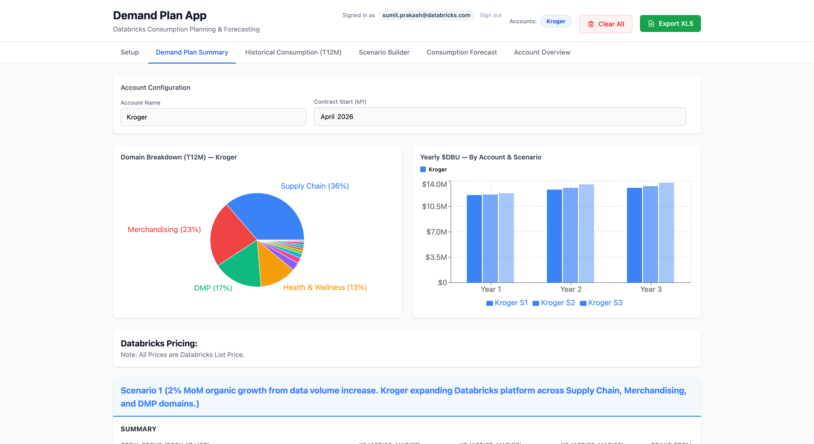

This tab shows:

- **Scenario comparison table**: Year 1, Year 2, Year 3, and Total for each scenario (S1, S2, S3)
- **Baseline vs. incremental breakdown**: How much comes from existing consumption growth vs. new use cases
- **Bar charts**: Visual comparison of scenario projections by year
- **Pie charts**: Composition breakdown showing baseline vs. use case contributions

This is the view you would present to an account executive or customer champion to frame the three options.

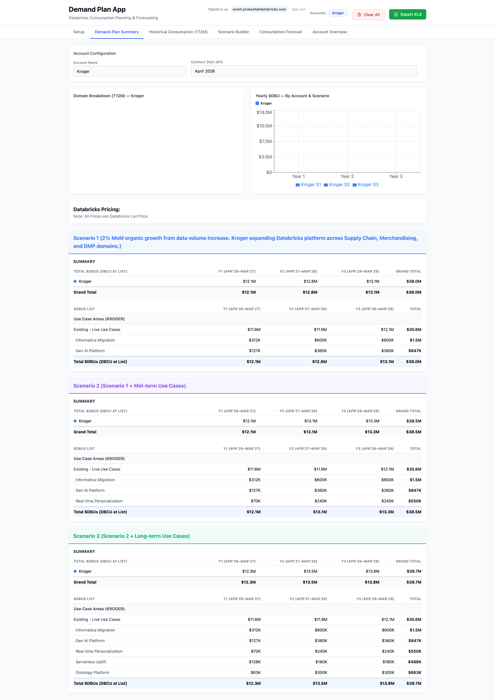

---

## Scenario Builder Tab

The Scenario Builder is the core modeling engine. It is where you define use cases, assign them to scenarios, configure SKU breakdowns, and see real-time projection calculations.

### Layout

The tab is organized into:

1. **Scenario selector** (S1 / S2 / S3 tabs) -- switches which scenario's projection table you see
2. **Summary cards** -- T12M Baseline, Year 1/2/3 Projected, and 3-Year Total
3. **Historical Baseline** -- Collapsible table showing domain-level T12M data with Avg/Mo and percentage
4. **Baseline Growth Rate** -- MoM growth applied to all historical consumption (default 2%)
5. **Assumptions** -- Free-text field for documenting rationale
6. **Monthly Baseline Overrides** -- Override specific months (shown in amber)
7. **Projection Table** -- Year 1/2/3 breakdown by use case
8. **Use Cases list** -- All use cases with S1/S2/S3 checkboxes

### Empty State

When no use cases are defined yet, the projection shows only baseline growth.

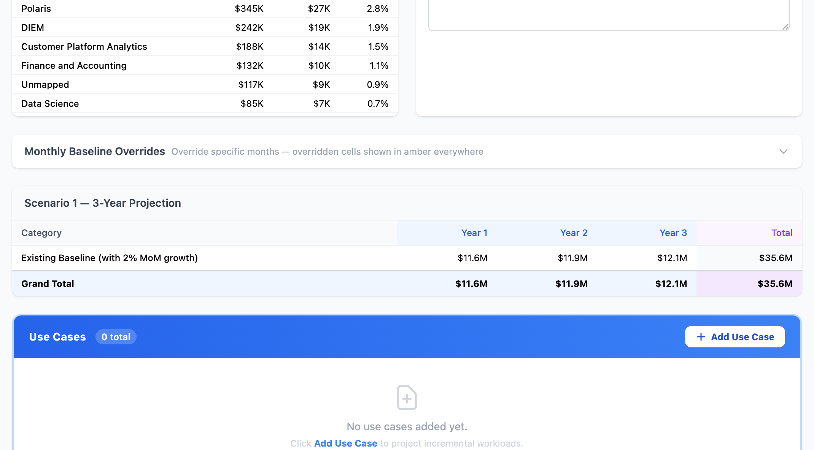

### With Use Cases (Scenario 1)

After adding use cases, the projection table shows baseline + each included use case.

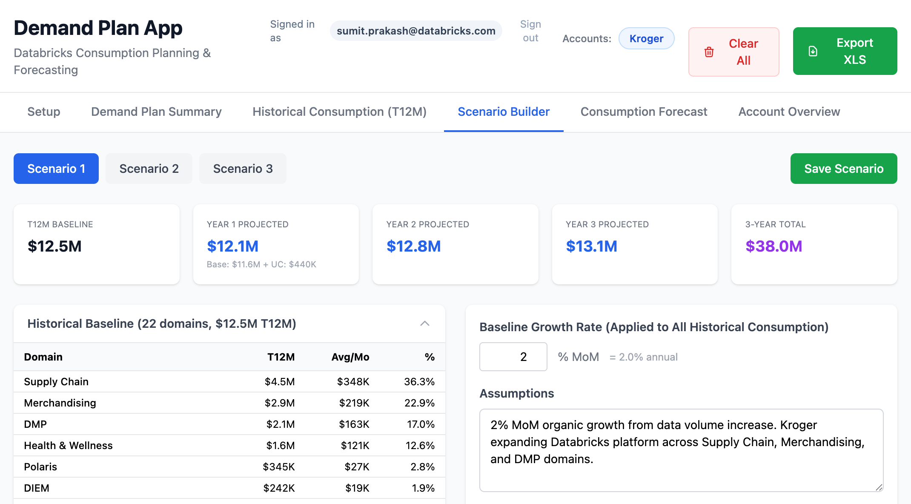

### Scenario 2 View

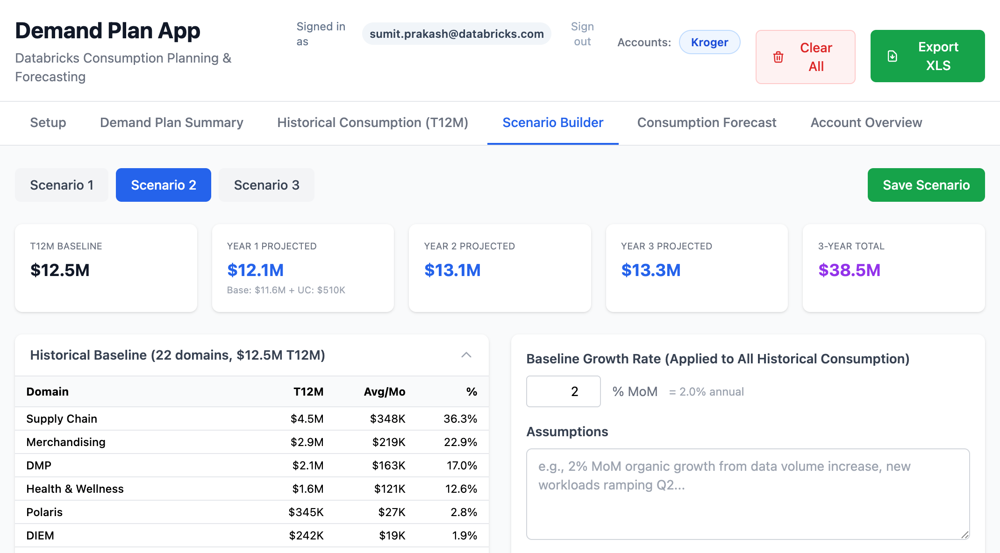

### Scenario 3 View

S3 includes all 5 use cases for the most aggressive forecast.

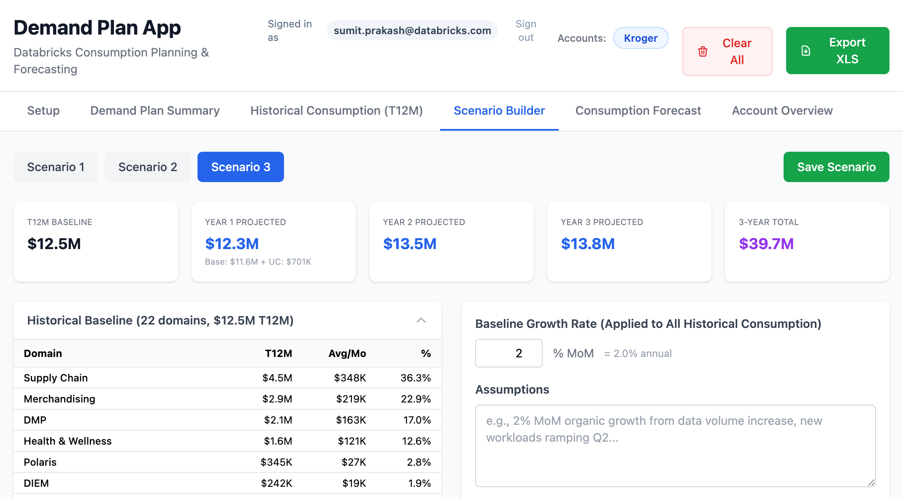

### Adding a Use Case

Click **Add Use Case** to create a new use case. Each use case has:

| Field | Description |
|-------|-------------|
| **Use Case Name** | Descriptive name (e.g., "Informatica Migration") |
| **Domain** | Business domain this workload belongs to (from domain mapping) |
| **Dollar Uplift Only** | Check if this is a price-tier migration, not new DBUs |
| **Steady-State Size** | T-shirt size (XS-XXXL) or custom $/month value |
| **Ramp Pattern** | Linear or Hockey Stick (exponential curve) |
| **Onboarding Month** | When the workload starts ramping (e.g., M3Y1) |
| **Live Month** | When it reaches full steady-state run rate |
| **Include in Scenarios** | S1/S2/S3 checkboxes |
| **Cloud** | AZURE or GCP |
| **Workload Type** | Preset (ETL, BI/Analytics, ML, Agentic AI, Migration) or Custom |
| **SKU Breakdown** | Per-SKU percentage split with auto-calculated DBUs and $/month |
| **Assumptions** | Per-use-case free text notes |

### T-Shirt Sizes

| Size | $/month | $/year | Description |
|------|---------|--------|-------------|
| XS | $2,500 | $30K | POC / Experiment |
| S | $5,000 | $60K | Single pipeline or dashboard |
| M | $15,000 | $180K | Team workload -- ETL + BI |
| L | $35,000 | $420K | Multi-pipeline ETL + ML |
| XL | $75,000 | $900K | Department -- heavy ETL + ML + BI |
| XXL | $150,000 | $1.8M | Business unit -- full platform |
| XXXL | $300,000 | $3.6M | Enterprise -- org-wide workload |
| Custom | User-defined | -- | Enter any $/month value |

### Workload Presets

Presets auto-populate the SKU breakdown table:

| Preset | SKU Mix |
|--------|---------|
| **ETL Pipeline** | Jobs Compute 50%, Jobs Compute (Photon) 30%, DLT Core 20% |
| **BI / Analytics** | Serverless SQL 60%, All Purpose Compute 25%, Jobs Compute 15% |
| **ML Platform** | All Purpose Compute 35%, Model Serving 30%, Jobs Compute 25%, Serverless SQL 10% |
| **Agentic AI** | Foundation Model API 40%, Model Serving 25%, Vector Search 20%, Serverless SQL 15% |
| **Migration** | Jobs Compute (Photon) 45%, Serverless SQL 30%, DLT Advanced 25% |
| **Custom** | Empty -- add SKU rows manually |

### Dollar Uplift Only

For workloads that represent a price-tier change (e.g., migrating from classic SQL to Serverless SQL), check the **Dollar uplift only** checkbox. This means:

- The use case contributes to **$DBU spend** but NOT to **DBU volume**
- The label says "$ uplift only" in the use case summary
- Column headers change from "DBUs/month" to "$/month split"
- The ramp preview shows "$15K/mo $ uplift" instead of "$15K/mo"

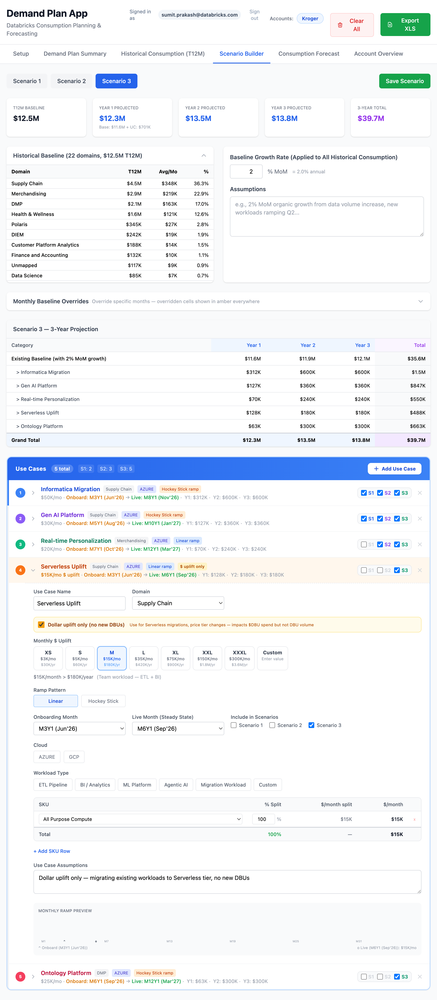

### Custom SKU

When a product is not in the standard price list, use the Custom SKU option:

1. In the SKU dropdown, select **"+ Custom SKU (new product)"**
2. Enter the **SKU name** (e.g., "Unity Catalog Advanced")
3. Enter the **custom $/DBU price** (e.g., $0.35)
4. Set the **percentage split** (e.g., 25%)

The custom SKU row shows an asterisk (*) next to the price to indicate it is user-defined.

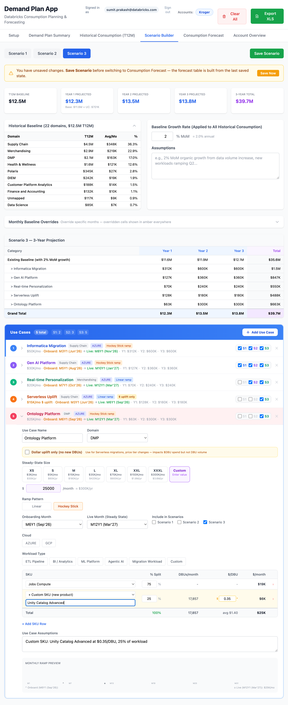

### Ramp Preview

Each use case includes a text-based monthly ramp preview at the bottom of the expanded form, showing:
- `^` marker for onboarding month
- `o` marker for live month (steady state)
- The monthly $/month trajectory from ramp start to steady state

### Saving

Click **Save Scenario** to persist all use cases. The app uses optimistic concurrency (version numbers) to prevent conflicts if multiple sessions are editing the same account.

---

## Consumption Forecast Tab

The Consumption Forecast tab renders the month-by-month projection from saved scenario data.

### Controls

- **$DBU / DBUs toggle**: Switch between dollar and DBU volume views
- **Months selector**: 12, 24, or 36 months
- **Scenario selector**: S1, S2, or S3 buttons
- **Refresh button**: Re-sync from the latest saved Scenario Builder data

### Use Cases Summary

At the top, a read-only table shows each use case with:
- Name and SKU breakdown (with percentage splits)
- Domain assignment
- Steady-state $/month
- Onboarding and live months
- S1/S2/S3 inclusion indicators

### Forecast Data Table

The main table shows month-by-month values for:
- **Existing Baseline** (with MoM growth rate applied)
- **Each use case** (with hockey-stick or linear ramp)
- **SKU sub-rows** (expandable, showing per-SKU monthly values)
- **Total Forecast** (sum of all rows)

Color coding:
- Onboarding month cells are highlighted
- Live month cells are highlighted
- Baseline override months appear in amber

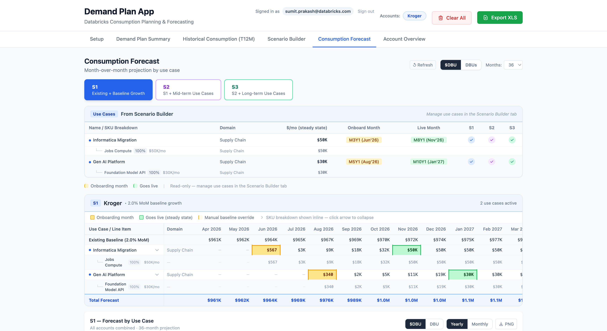

### S3 View (All 5 Use Cases)

Switching to S3 shows all five use cases in the forecast:

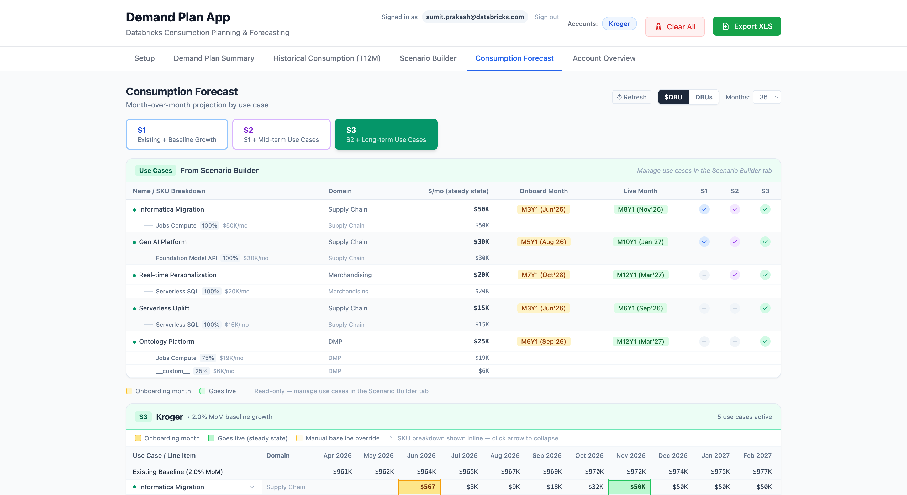

### Domain Forecast Charts

Below the data table, charts visualize the forecast:

- **Yearly view**: Stacked bar chart showing baseline + use case contributions by year
- **Monthly view**: Time-series line chart showing monthly progression
- **$DBU / DBU toggle**: Switch the chart metric
- **Download as PNG**: Export the chart for presentations

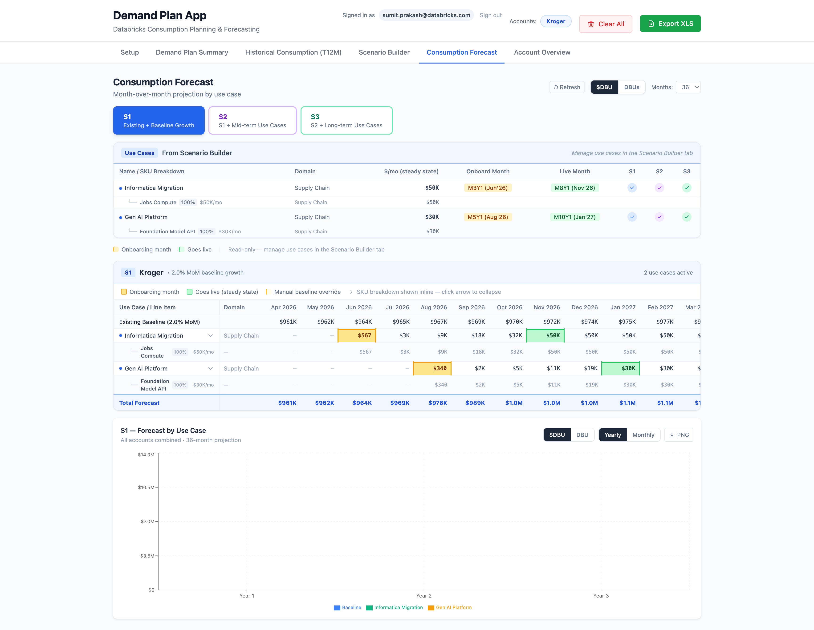

---

## Account Overview Tab

The Account Overview tab provides a high-level dashboard for the selected account.

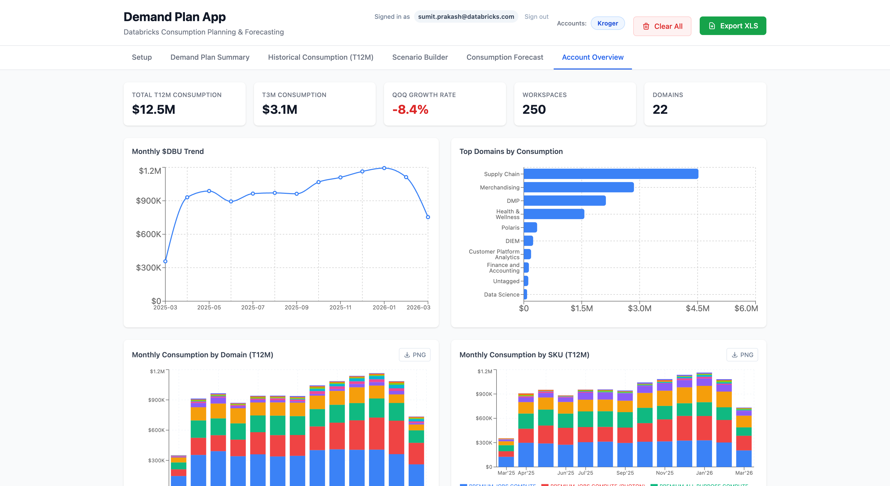

This tab includes:

- **Account metrics**: Key consumption statistics and trends
- **Contract health / burn curve**: How the account is tracking against contract commitments
- **Trend charts**: Visual representation of consumption patterns over time

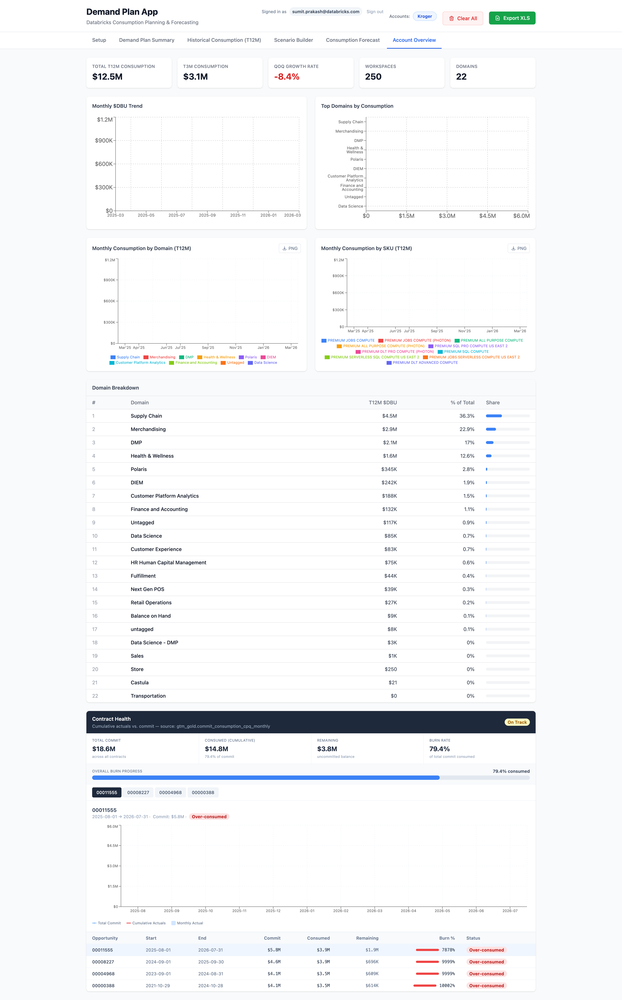

---

## Export XLS

Click the **Export XLS** button in the header bar to generate a branded Excel workbook.

### Sheets Included

| Sheet | Contents |
|-------|----------|
| **Demand Plan Summary** | All 3 scenarios side-by-side with year totals |
| **S1 Projection** | Month-by-month forecast for Scenario 1 |
| **S2 Projection** | Month-by-month forecast for Scenario 2 |
| **S3 Projection** | Month-by-month forecast for Scenario 3 |
| **Historical by Domain** | T12M consumption aggregated by domain |
| **Historical by SKU** | T12M consumption aggregated by SKU |
| **Cloud-Domain-SKU** | Three-level hierarchy view |
| **Use Case Details** | Each use case with SKU breakdown, ramp settings, assumptions |
| **Domain Baseline** | Per-domain monthly baseline with growth applied |

### Output

- **Filename**: `Demand_Plan_{AccountName}_AllScenarios_{date}.xlsx`
- **Styling**: Branded with Databricks colors, frozen headers, auto-width columns
- **Generation**: Client-side using ExcelJS (no server round-trip needed)

---

## Use Case Walkthrough: Kroger

This walkthrough demonstrates a complete demand planning session for Kroger (SFDC ID: `0016100001IwIDPAA3`), building three scenarios with five use cases.

### Scenario Structure

| Use Case | SKU | $/mo Steady State | Onboard | Live | S1 | S2 | S3 |
|----------|-----|-------------------|---------|------|----|----|-----|
| Informatica Migration | Jobs Compute (100%) | $50,000 | M3Y1 (Jun'26) | M8Y1 (Nov'26) | Yes | Yes | Yes |
| Gen AI Platform | Foundation Model API (100%) | $30,000 | M5Y1 (Aug'26) | M10Y1 (Jan'27) | Yes | Yes | Yes |
| Real-time Personalization | Serverless SQL (100%) | $20,000 | M7Y1 (Oct'26) | M12Y1 (Mar'27) | No | Yes | Yes |
| Serverless Uplift | Dollar uplift only | $15,000 | M3Y1 (Jun'26) | M6Y1 (Sep'26) | No | No | Yes |
| Ontology Platform | Jobs Compute 75% + Custom "Unity Catalog Advanced" 25% @ $0.35/DBU | $25,000 | M6Y1 (Sep'26) | M12Y1 (Mar'27) | No | No | Yes |

**Scenario definitions:**
- **S1 (Conservative)**: Existing baseline + Informatica Migration + Gen AI Platform (2 use cases)
- **S2 (Moderate)**: S1 + Real-time Personalization (3 use cases)
- **S3 (Aggressive)**: S2 + Serverless Uplift + Ontology Platform (5 use cases)

### Step-by-Step

#### 1. Login

1. Open http://localhost:5174
2. The Logfood workspace URL is pre-filled
3. Enter your PAT and click **Sign In**

#### 2. Setup

1. Select a running SQL warehouse (e.g., "Shared SQL Endpoint - Cutting Edge")
2. Click **Save Warehouse**
3. Search for "Kroger" and click **+** to add the account
4. Set **Contract Start** to **April 2026**
5. Set **Contract Term** to **3 Years**
6. Upload the domain mapping CSV (located at `~/Desktop/Kroger - Sheet1.csv`) -- this maps 239 workspaces to domains like Supply Chain, Merchandising, DMP, Health & Wellness, etc.
7. Click **Load** to pull T12M consumption data from Logfood

The baseline shows **$12.5M** total T12M consumption across 22 domains and 250 workspaces.

#### 3. Review Historical Data

Navigate to the **Historical Consumption (T12M)** tab to verify the data:

- **By Domain**: Supply Chain is the largest at $4.5M (36.3%), followed by Merchandising at $2.9M (22.9%) and DMP at $2.1M (17.0%)
- **By SKU**: See which Databricks products are in use
- **Cloud-Domain-SKU**: Verify the data is almost entirely Azure (with small GCP presence)

#### 4. Build Scenarios

Navigate to the **Scenario Builder** tab.

**Add Use Case 1: Informatica Migration**
1. Click **Add Use Case**
2. Name: `Informatica Migration`
3. Domain: `Supply Chain`
4. Steady-State Size: Custom, enter `50000` ($/month)
5. Ramp: Hockey Stick
6. Onboarding: M3Y1 (Jun'26)
7. Live: M8Y1 (Nov'26)
8. Scenarios: Check S1, S2, S3
9. Cloud: AZURE
10. Workload Type: Custom, add SKU row "Jobs Compute" at 100%

**Add Use Case 2: Gen AI Platform**
1. Click **Add Use Case**
2. Name: `Gen AI Platform`
3. Domain: `Supply Chain`
4. Steady-State Size: Custom, enter `30000`
5. Ramp: Hockey Stick
6. Onboarding: M5Y1 (Aug'26)
7. Live: M10Y1 (Jan'27)
8. Scenarios: Check S1, S2, S3
9. Workload Type: Custom, add "Foundation Model API" at 100%

**Add Use Case 3: Real-time Personalization**
1. Click **Add Use Case**
2. Name: `Real-time Personalization`
3. Domain: `Merchandising`
4. Steady-State Size: Custom, enter `20000`
5. Ramp: Linear
6. Onboarding: M7Y1 (Oct'26)
7. Live: M12Y1 (Mar'27)
8. Scenarios: Check S2 and S3 only (NOT S1)
9. Workload Type: Custom, add "Serverless SQL" at 100%

**Add Use Case 4: Serverless Uplift**
1. Click **Add Use Case**
2. Name: `Serverless Uplift`
3. Domain: `Supply Chain`
4. Check **Dollar uplift only (no new DBUs)** -- this is a price-tier migration
5. Steady-State Size: M ($15,000/mo)
6. Ramp: Linear
7. Onboarding: M3Y1 (Jun'26)
8. Live: M6Y1 (Sep'26)
9. Scenarios: Check S3 only

**Add Use Case 5: Ontology Platform**
1. Click **Add Use Case**
2. Name: `Ontology Platform`
3. Domain: `DMP`
4. Steady-State Size: Custom, enter `25000`
5. Ramp: Hockey Stick
6. Onboarding: M6Y1 (Sep'26)
7. Live: M12Y1 (Mar'27)
8. Scenarios: Check S3 only
9. Workload Type: Custom
10. Add SKU row 1: "Jobs Compute" at 75%
11. Add SKU row 2: Select **"+ Custom SKU (new product)"**, name it `Unity Catalog Advanced`, set price to `0.35` $/DBU, set percentage to 25%

**Save**: Click **Save Scenario**

#### 5. Review Projections

The Scenario 3 projection table shows:

| Category | Year 1 | Year 2 | Year 3 | Total |
|----------|--------|--------|--------|-------|
| Existing Baseline (2% MoM) | $11.6M | $11.9M | $12.1M | $35.6M |
| Informatica Migration | $312K | $600K | $600K | $1.5M |
| Gen AI Platform | $127K | $360K | $360K | $847K |
| Real-time Personalization | $70K | $240K | $240K | $550K |
| Serverless Uplift | $128K | $180K | $180K | $488K |
| Ontology Platform | $63K | $300K | $300K | $663K |
| **Grand Total** | **$12.3M** | **$13.5M** | **$13.8M** | **$39.7M** |

#### 6. Consumption Forecast

Navigate to the **Consumption Forecast** tab:

1. Switch between S1/S2/S3 to see how the forecast changes
2. Toggle $DBU vs DBU to see volume impact
3. Expand SKU sub-rows to see per-SKU monthly values
4. Use the yearly/monthly chart toggle to visualize the forecast
5. Download the chart as PNG for presentations

#### 7. Export

Click **Export XLS** in the header bar. The generated Excel file includes all scenarios, historical data, use case details, and domain baselines in a single branded workbook.

**Output file**: `Demand_Plan_Kroger_AllScenarios_2026-03-20.xlsx`

---

## Tips for Field Engineers

1. **Start with domain mapping** -- without it, historical data is all "Unmapped" and the domain-level analysis is meaningless. Download the template, fill it in with the customer, then upload.

2. **Use t-shirt sizes for quick estimates** -- if you do not have precise sizing, start with t-shirts and refine later.

3. **Hockey stick ramp is more realistic** -- most workloads start slow and accelerate. Use linear only for simple migrations.

4. **Dollar uplift only for migrations** -- when a customer is migrating from classic to serverless, the DBU volume stays the same but the price per DBU changes. Use "Dollar uplift only" to model this correctly.

5. **Custom SKUs for new products** -- if a product is not in the price list (e.g., Unity Catalog Advanced, new model serving tiers), use the custom SKU option with a user-defined price.

6. **Save frequently** -- the app uses optimistic concurrency. If another session modifies the same account, you will get a conflict error and need to reload.

7. **Export before the meeting** -- generate the Excel ahead of time. The export includes all three scenarios, so you can walk through them with the customer.

8. **Use the Demand Plan Summary tab for the executive view** -- it shows all three scenarios side-by-side, which is the right level of detail for an AE or VP conversation.

9. **Use the Consumption Forecast tab for the detailed view** -- it shows month-by-month projections, which is what the data engineering team wants to see.

10. **Clear All resets everything** -- the "Clear All" button in the header wipes cached data and resets all accounts. Use with caution.
