# Demand Plan App — End-to-End Guide

**Date:** 2026-03-19
**Accounts Used:** Kroger (`0016100001IwIDPAA3`) and 84.51 (`0016100000afNAcAAM`)
**Environment:** http://localhost:5173 (Vite dev server) + http://localhost:8000 (FastAPI backend)

---

## Table of Contents

1. [Overview](#overview)
2. [Prerequisites](#prerequisites)
3. [Deployment & Startup](#deployment--startup)
4. [App Walkthrough](#app-walkthrough)
   - [Setup Tab](#1-setup-tab)
   - [Historical Consumption](#2-historical-consumption-t12m)
   - [Scenario Builder](#3-scenario-builder)
   - [Consumption Forecast](#4-consumption-forecast)
   - [Demand Plan Summary](#5-demand-plan-summary)
   - [Account Overview](#6-account-overview)
   - [Export](#7-export)
5. [Use Case Testing — Kroger & 84.51](#use-case-testing--kroger--8451)
6. [Export Results](#export-results)

---

## Overview

The **Demand Plan App** is a Databricks Consumption Planning & Forecasting tool built for Field Engineering. It lets you:

- Load historical consumption data for one or more Salesforce accounts
- Visualize T12M (trailing 12-month) usage by domain and SKU
- Build 3-year consumption projections across 3 scenarios (S1/S2/S3)
- Model incremental use cases on top of baseline growth
- Export plans to Excel or upload directly to Google Drive

---

## Prerequisites

| Requirement | Details |
|---|---|
| Python 3.11+ | Backend (FastAPI) |
| Node.js 18+ | Frontend (Vite + React) |
| Databricks CLI | Authenticated to logfood workspace |
| Google OAuth | Authorized via Setup tab for Drive uploads |
| SFDC account IDs | Required to load account data |

---

## Deployment & Startup

### 1. Clone the Repository

```bash
git clone <repo-url>
cd demand-plan-app
```

### 2. Backend Setup

```bash
cd server
pip install -r requirements.txt
```

Ensure your Databricks CLI is authenticated to the **logfood** workspace:

```bash
databricks auth profiles | grep logfood
# Should show: logfood    YES
```

Start the FastAPI backend:

```bash
uvicorn main:app --reload --port 8000
```

The backend exposes REST endpoints at `http://localhost:8000`:
- `GET /api/setup/status` — Databricks + Google auth status
- `GET /api/accounts-search?q=<name>` — SFDC account search
- `POST /api/setup/load-account` — load historical data for an account
- `POST /api/export/upload-to-drive` — build Excel and upload to Google Drive

### 3. Frontend Setup

```bash
cd frontend
npm install
npm run dev
```

The React app starts at `http://localhost:5173`.

### 4. Open the App

Navigate to **http://localhost:5173** in Chrome. The app opens on the **Setup** tab by default.

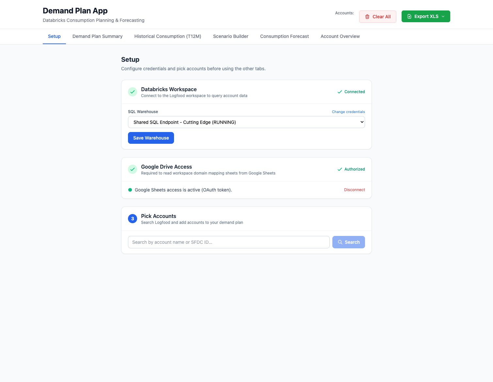

---

## App Walkthrough

### 1. Setup Tab

The Setup tab is the starting point. It shows:

- **Databricks Connection** — green badge when the backend can reach the logfood SQL warehouse
- **Google OAuth** — authorization status for Google Drive uploads
- **Account Search** — search for Salesforce accounts by name and add them to your plan
- **Loaded Accounts** — list of configured accounts with their contract start dates and domain mapping URLs

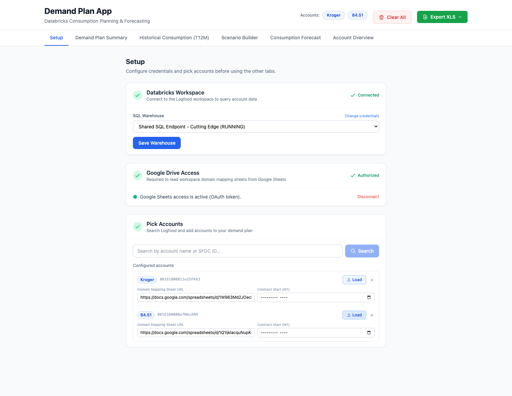

#### Adding Accounts

1. Type an account name in the search box and click **Search**
2. Check the account checkbox in the results panel
3. Click **Add 1 account →** — the results panel auto-closes
4. Optionally set the **Domain Mapping URL** (Google Sheets link for SKU→domain mapping)
5. Click **Load** (per-account button) to fetch historical consumption from Databricks

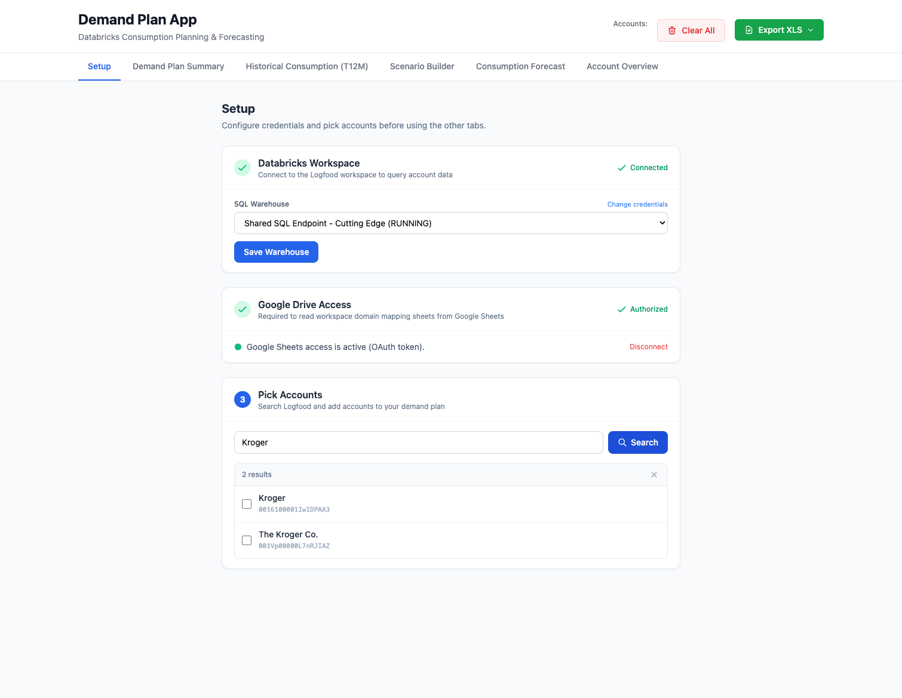

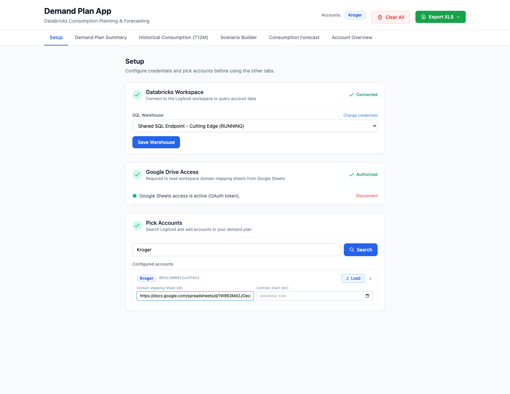

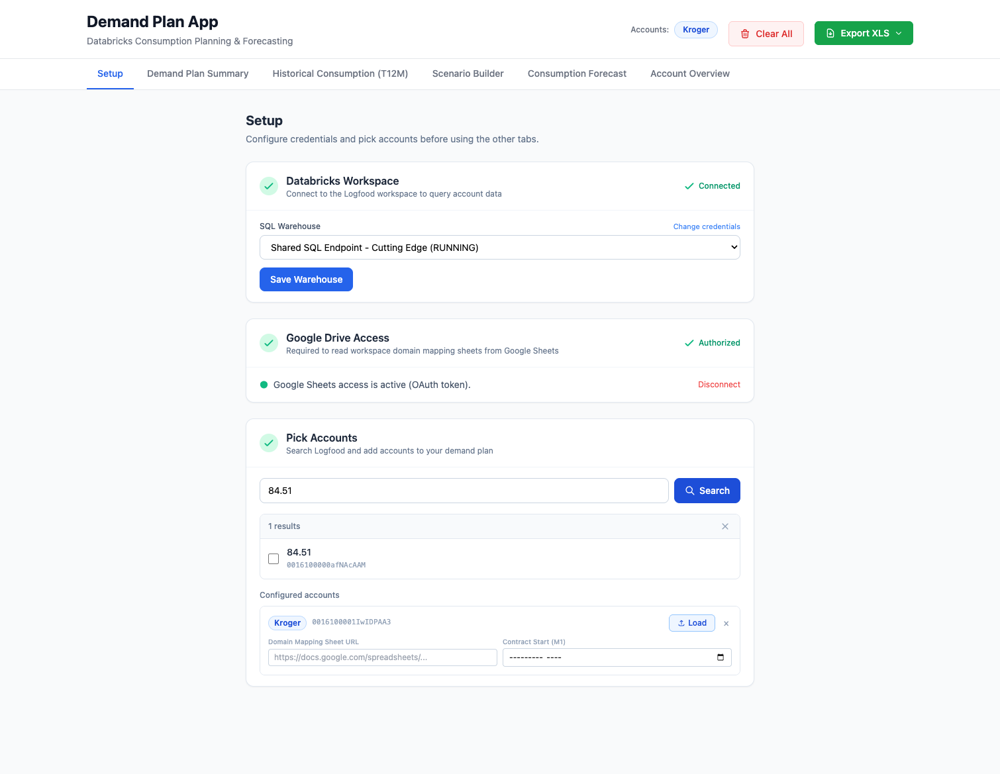

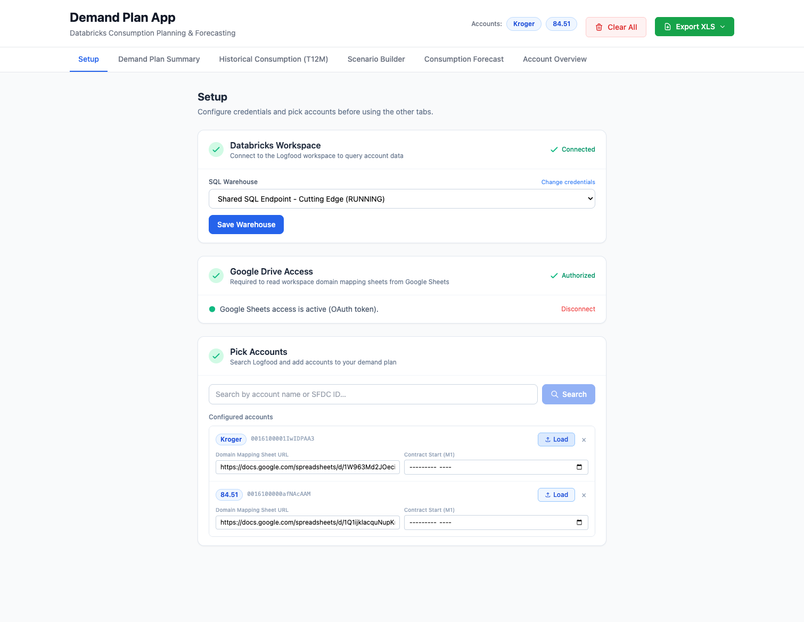

#### Loading Account Data

After adding accounts, click the **Load** button next to each account. This queries the logfood Databricks workspace for T12M historical consumption data, domain breakdowns, and SKU details.


---

### 2. Historical Consumption (T12M)

This tab visualizes the trailing 12-month consumption for the selected accounts.

**Features:**
- **Monthly trend chart** — bar chart of $DBU spend per month
- **Domain breakdown table** — consumption by domain with T12M total, monthly average, and % share
- **SKU breakdown** — individual SKU-level spend within each domain
- **Account switcher** — toggle between loaded accounts using the top tab buttons

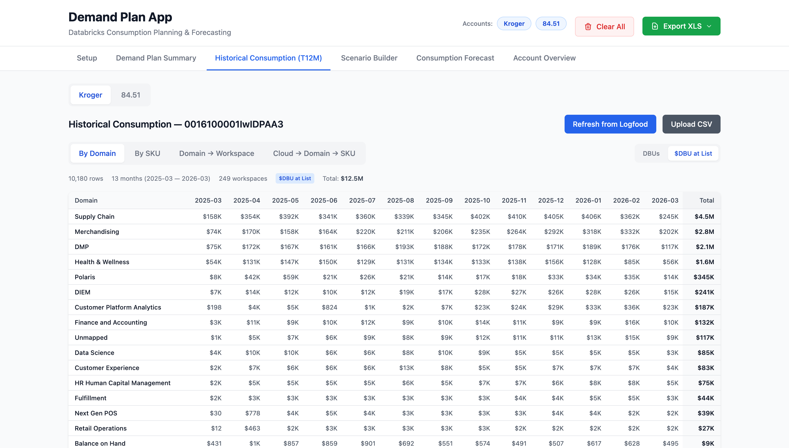

---

### 3. Scenario Builder

The Scenario Builder is the core planning tool. It lets you define 3 independent scenarios (S1, S2, S3) per account.

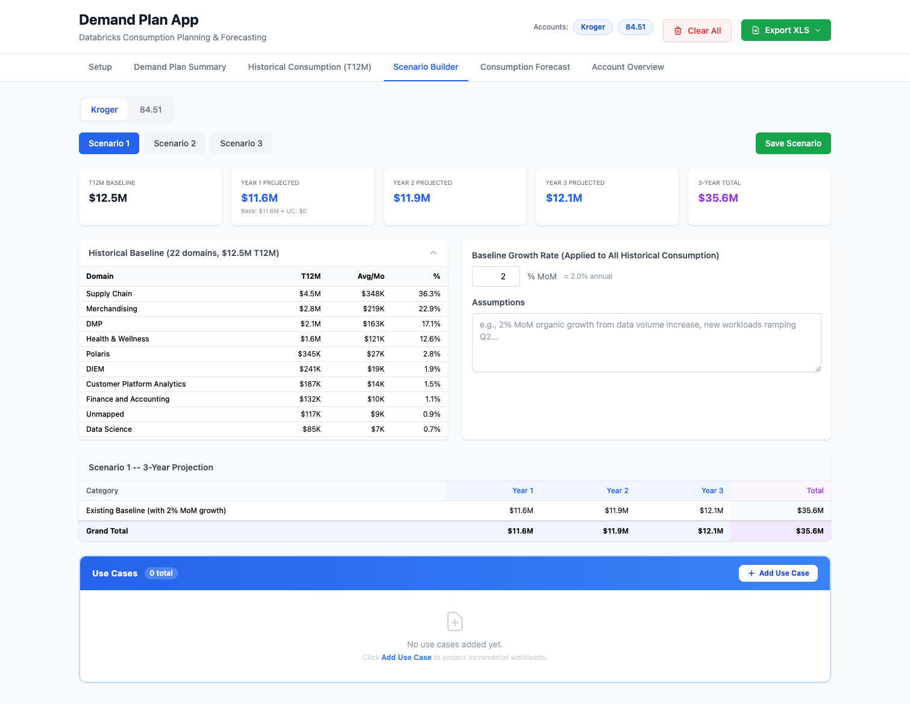

#### Structure

Each scenario has:
- **Baseline** — the T12M historical consumption with an optional MoM growth rate (default 2%)
- **Use Cases** — incremental workloads to add on top of the baseline
- **Assumptions** — free-text field for notes

#### Scenario Summary Panel

At the top of each scenario view, 4 key metrics are shown:
- T12M Baseline
- Year 1 Projected (Base + UC)
- Year 2 Projected
- Year 3 Projected
- 3-Year Total

The **3-Year Projection table** below shows the breakdown by use case.

#### Adding Use Cases

1. Click **Add Use Case** — a new row appears in the use case list with default S1/S2/S3 assignment based on the current scenario view
2. Click the use case row to expand its edit form
3. Configure:
   - **Use Case Name** — e.g., "Supply Chain Lakehouse Migration"
   - **Domain** — select from existing historical domains
   - **Steady-State Size** — XS ($3K/mo) through XXXL ($300K/mo), or Custom
   - **Ramp Pattern** — Linear or Hockey Stick
   - **Onboarding Month** — when the use case starts ramping
   - **Live Month** — when full steady-state spend is reached
   - **Include in Scenarios** — checkboxes to assign the UC to S1, S2, and/or S3
   - **Cloud** — AWS or AZURE
   - **Workload Type** — ETL Pipeline, BI/Analytics, ML Platform, Agentic AI, Migration Workload, Custom

4. Click **Save Scenario** when done

The **Monthly Ramp Preview** at the bottom shows a visual ASCII chart of the ramp curve.

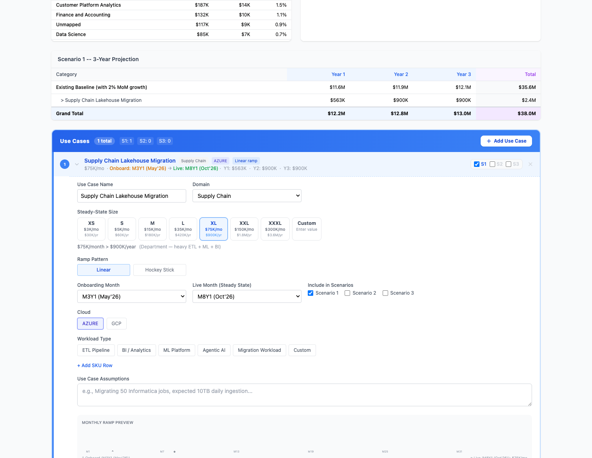

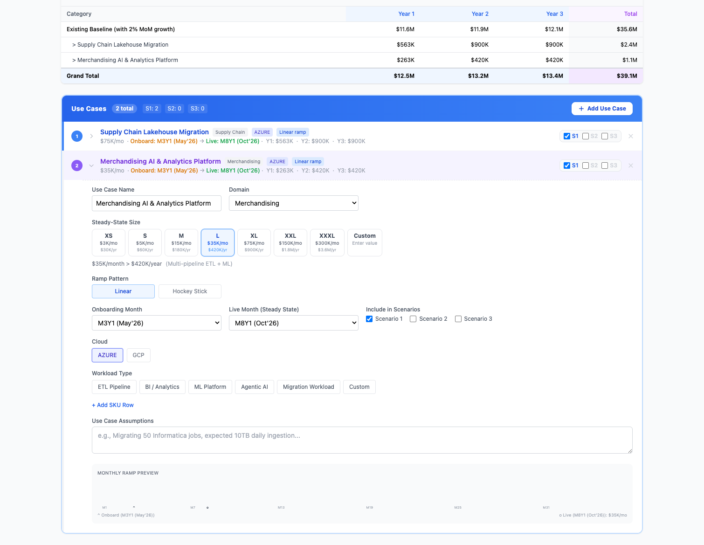

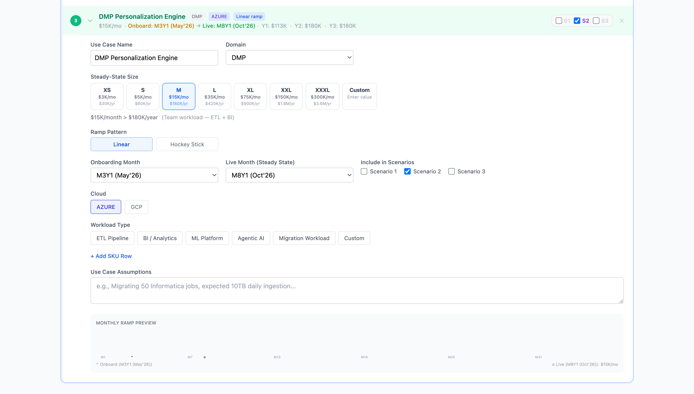

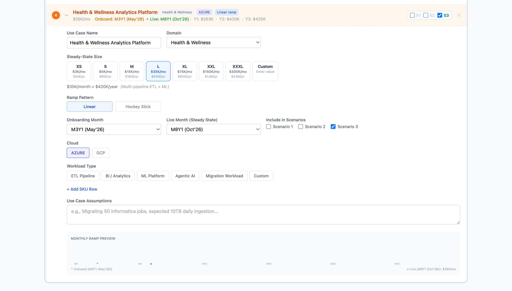

---

### 4. Consumption Forecast

The Consumption Forecast tab shows a month-by-month projection table built from the last **saved** scenario state.

> **Note:** You must click **Save Scenario** in the Scenario Builder before the forecast reflects your latest changes.

**Features:**
- Month columns from the contract start date through Year 3
- Rows per use case with monthly dollar amounts
- Baseline row showing organic growth
- Grand total row

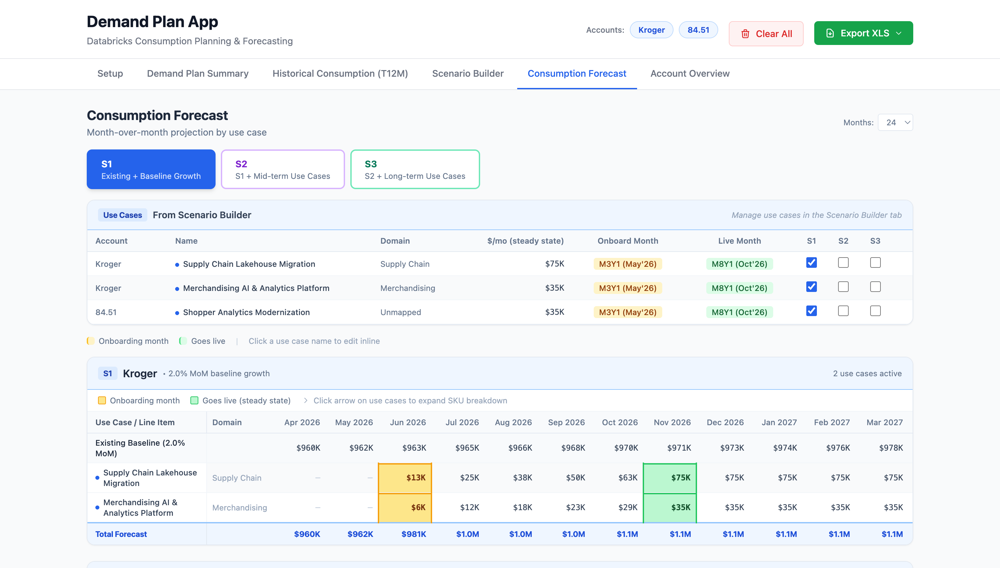

---

### 5. Demand Plan Summary

The Demand Plan Summary aggregates projections across **all loaded accounts** and all 3 scenarios.

**Features:**
- Combined 3-year table (all accounts × S1/S2/S3)
- Per-account breakdown with Year 1/2/3 and Total columns
- Scenario toggle (S1 / S2 / S3 buttons)
- Use case contributions shown separately from baseline

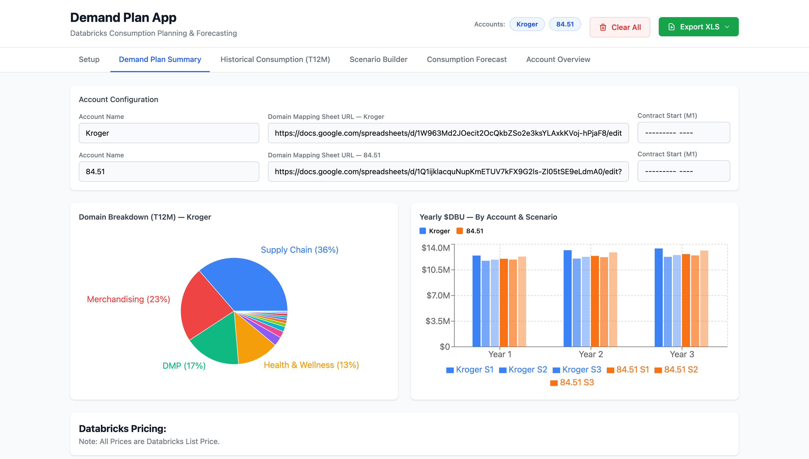

---

### 6. Account Overview

The Account Overview tab provides a high-level view of each account's historical consumption profile.

**Features:**
- KPI cards: Total T12M, T3M, QoQ Growth Rate, Workspaces, Domains
- **Monthly $DBU Trend** — 12-month bar chart
- **Top Domains by Consumption** — horizontal bar chart
- **Domain Breakdown** table with T12M $DBU and % share


---

### 7. Export

Click the **Export XLS** button (top-right) to open the export menu with 3 options:

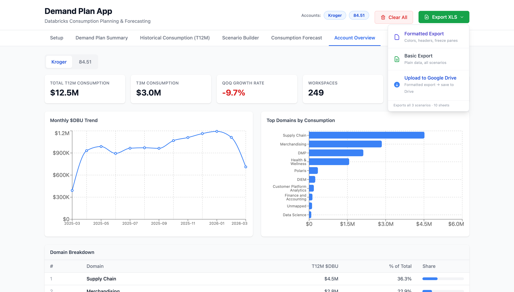

#### Formatted Export

Generates a multi-sheet Excel workbook with:
- Colors, headers, freeze panes
- **Demand Plan Summary** sheet
- **S1 / S2 / S3 — Projection** sheets (real calendar month headers, all accounts)
- Per-account **Hist-Domain**, **Hist-SKU**, **Cloud-Domain-SKU** sheets
- Per-account **Use Cases** sheet with SKU sub-rows
- Per-account **Baseline** and **SKU Detail** sheets

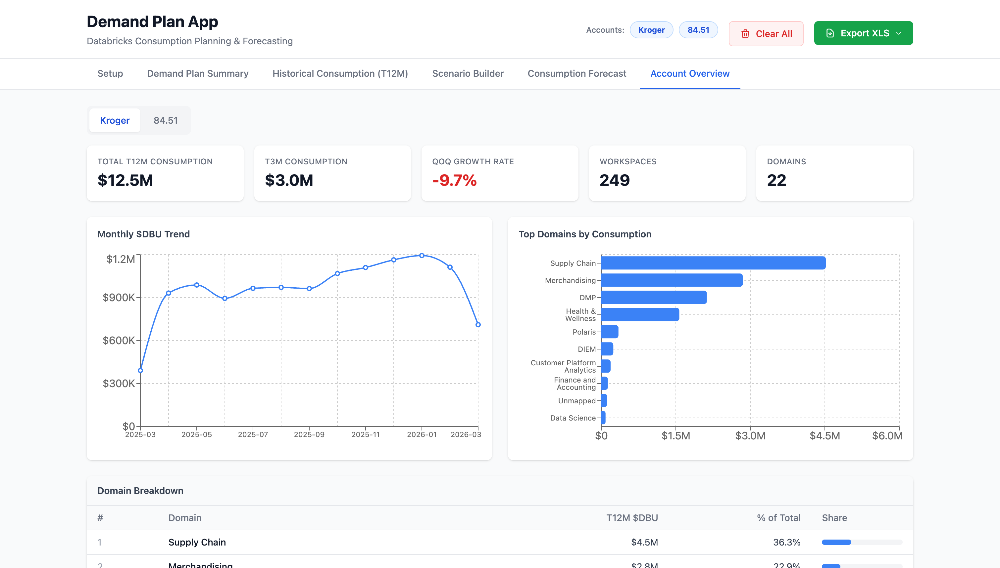

#### Basic Export

Plain data export, all scenarios, no formatting.

#### Upload to Google Drive

Builds the formatted Excel workbook and uploads it to Google Drive via the backend. On success, a toast notification appears with:
- Upload confirmation
- File name
- Google Drive URL (copyable monospace box)
- "Open in Drive →" link


---

## Use Case Testing — Kroger & 84.51

The following use cases were added across all 3 scenarios for both accounts.

---

### Kroger (`0016100001IwIDPAA3`)

**Domain Mapping:** Kroger Google Sheets

| # | Use Case | Domain | Size | Scenario | Ramp | Y1 | Y2 | Y3 | Total |
|---|---|---|---|---|---|---|---|---|---|
| 1 | Supply Chain Lakehouse Migration | Supply Chain | XL $75K/mo | **S1** | Linear | $563K | $900K | $900K | $2.36M |
| 2 | Merchandising AI & Analytics Platform | Merchandising | L $35K/mo | **S1** | Linear | $263K | $420K | $420K | $1.10M |
| 3 | DMP Personalization Engine | DMP | M $15K/mo | **S2** | Linear | $113K | $180K | $180K | $473K |
| 4 | Health & Wellness Analytics Platform | Health & Wellness | L $35K/mo | **S3** | Linear | $263K | $420K | $420K | $1.10M |

**Scenario Summary (Kroger):**

| Scenario | Y1 | Y2 | Y3 | Total |
|---|---|---|---|---|
| S1 (Baseline + UC1 + UC2) | ~$12.4M | ~$13.2M | ~$13.5M | ~$39.1M |
| S2 (Baseline + UC3) | ~$11.7M | ~$12.0M | ~$12.3M | ~$36.1M |
| S3 (Baseline + UC4) | ~$11.9M | ~$12.3M | ~$12.5M | ~$36.7M |

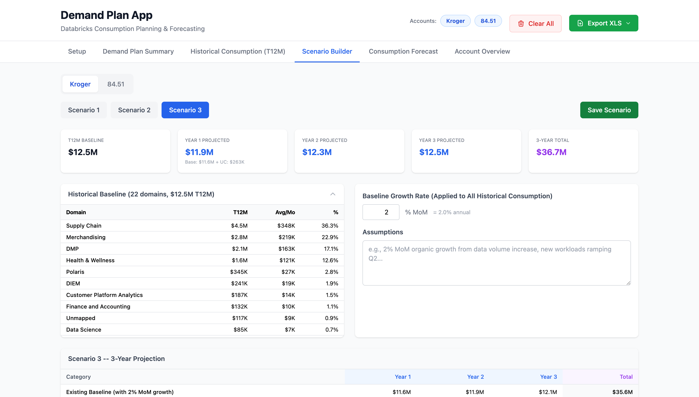

---

### 84.51 (`0016100000afNAcAAM`)

**Domain Mapping:** 84.51 Google Sheets

| # | Use Case | Domain | Size | Scenario | Ramp | Y1 | Y2 | Y3 | Total |
|---|---|---|---|---|---|---|---|---|---|
| 1 | Shopper Analytics Modernization | Unmapped | L $35K/mo | **S1** | Linear | $263K | $420K | $420K | $1.10M |
| 2 | Real-Time Personalization Engine | Unmapped | M $15K/mo | **S2** | Linear | $113K | $180K | $180K | $473K |
| 3 | Supplier Intelligence Platform | Unmapped | S $5K/mo | **S2** | Linear | $38K | $60K | $60K | $158K |
| 4 | Retail Media Network Analytics | Unmapped | XL $75K/mo | **S3** | Linear | $563K | $900K | $900K | $2.36M |

**Scenario Summary (84.51):**

| Scenario | Y1 | Y2 | Y3 | Total |
|---|---|---|---|---|
| S1 (Baseline + UC1) | ~$12.1M | ~$12.4M | ~$12.7M | ~$37.1M |
| S2 (Baseline + UC2 + UC3) | ~$11.9M | ~$12.2M | ~$12.5M | ~$36.6M |
| S3 (Baseline + UC4) | ~$12.3M | ~$12.9M | ~$13.1M | ~$38.4M |

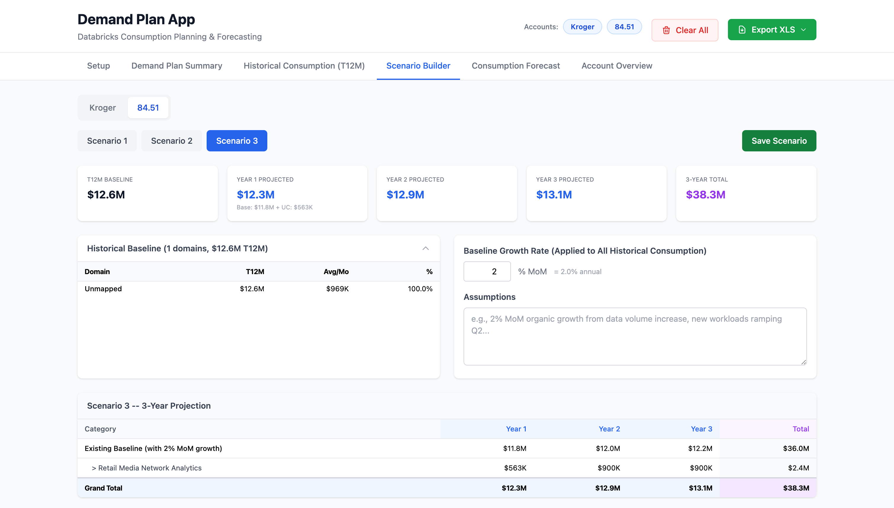

---

## Export Results

### Formatted Excel Export

The formatted export was downloaded successfully as:

```
Demand_Plan_Kroger_84.51_AllScenarios_2026-03-19.xlsx
```

Sheets included:
| Sheet | Description |
|---|---|
| Demand Plan Summary | Combined across all accounts |
| S1 - Projection | Scenario 1: all accounts, real calendar month headers |
| S2 - Projection | Scenario 2: same structure |
| S3 - Projection | Scenario 3: same structure |
| Kroger Hist-Domain | Historical by domain |
| Kroger Hist-SKU | Historical by SKU |
| Kroger Cloud-Domain-SKU | Cloud/domain/SKU breakdown |
| Kroger Use Cases | Use case details with SKU sub-rows |
| Kroger Baseline | Baseline consumption |
| Kroger SKU Detail | SKU-level detail |
| 84.51 Hist-Domain | Historical by domain |
| 84.51 Hist-SKU | Historical by SKU |
| 84.51 Cloud-Domain-SKU | Cloud/domain/SKU breakdown |
| 84.51 Use Cases | Use case details |
| 84.51 Baseline | Baseline consumption |
| 84.51 SKU Detail | SKU-level detail |

### Google Drive Upload

Excel uploaded to Google Drive:
- **File:** `Demand_Plan_Kroger_84.51_AllScenarios_2026-03-19.xlsx`
- **Drive URL:** https://drive.google.com/file/d/1ThZrK5vRU04nI0vT6kt0amZTudju3Hqu/view


---

## Key Features Summary

| Feature | Description |
|---|---|
| Default Setup Tab | App opens on Setup, not Summary |
| Account Search | Live search with × close button and auto-close on add |
| Per-Account Load | Independent Load button per account |
| Domain Mapping URL | Google Sheets URL stored per account for SKU → domain resolution |
| Multi-Scenario Planning | 3 independent scenarios (S1/S2/S3) per account |
| Use Case Assignment | Each use case can be included in any combination of S1/S2/S3 |
| Real Calendar Headers | Export uses `May_2026`, `Jun_2026` format (not M1/M2) |
| Multi-Account Projections | All accounts appear as sections in shared S1/S2/S3 sheets |
| Formatted Excel Export | Colors, freeze panes, SKU sub-rows, per-account sheets |
| Google Drive Upload | Backend multipart upload with Drive URL in success toast |
| Clear All | Resets all accounts and cached data to blank state |
